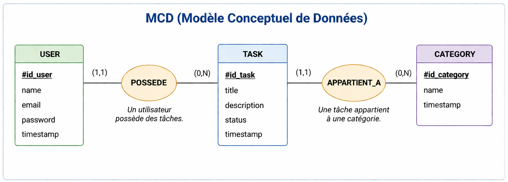
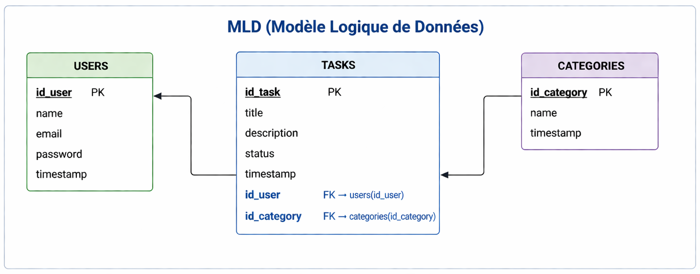

# 📋 Task Manager — Laravel

Application de gestion de tâches développée avec **Laravel 13** et **PHP 8.3**, offrant une interface premium avec un système complet de CRUD, filtrage, et gestion de statuts.

---

## 🚀 Fonctionnalités

### Gestion des Tâches
- **CRUD complet** : Créer, lire, modifier et supprimer des tâches
- **Page de détail** : Vue détaillée avec hero banner, barre de progression, et sidebar
- **Mise à jour rapide** : Changer le statut directement depuis la liste ou la page de détail
- **Catégories** : Organiser les tâches par catégorie

### Système de Statuts
| Statut | Description |
|--------|-------------|
| 📋 À faire | Tâche en attente |
| ⚡ En cours | Tâche en cours de réalisation |
| 🔍 En révision | Tâche en cours de vérification |
| ✅ Terminé | Tâche complétée (statut verrouillé) |

### Workflow Hybride (Tâches Terminées)
- ✅ Modification du titre, description, catégorie → **toujours autorisée**
- ❌ Changement de statut → **verrouillé** quand la tâche est terminée
- 🔄 Bouton **"Réouvrir"** → remet la tâche en "À faire"

### Filtrage & Recherche
- Filtrer par **statut** (À faire, En cours, En révision, Terminé)
- Filtrer par **catégorie** (nom affiché dans l'URL au lieu de l'ID)
- Pagination (10 tâches par page)

### Authentification
- Inscription / Connexion / Déconnexion
- Mot de passe oublié
- Profil utilisateur modifiable
- Chaque utilisateur ne voit que **ses propres tâches**

### Interface Premium
- Design glassmorphism avec sidebar fixe
- Hero banner adaptatif selon le statut (couleur dynamique)
- Barre de progression visuelle des étapes
- Animations d'entrée (fade-up)
- Badges de statut colorés
- Countdown pour les dates d'échéance
- Design responsive (mobile-friendly)

---

## 🛠️ Technologies

| Technologie | Version |
|-------------|---------|
| PHP | 8.3 |
| Laravel | 13.x |
| MySQL | 8.x |
| CSS | Vanilla (design system custom) |
| Serveur | Laragon |

---

## ⚙️ Installation

### Prérequis
- PHP 8.3+
- Composer
- MySQL
- Laragon (recommandé) ou un autre environnement local

### Étapes

```bash
# 1. Cloner le projet
git clone https://github.com/Dev-Lhabib/task-manager-laravel.git
cd task-manager-laravel

# 2. Installer les dépendances
composer install

# 3. Configurer l'environnement
cp .env.example .env
php artisan key:generate

# 4. Configurer la base de données dans .env
# DB_DATABASE=task_manager
# DB_USERNAME=root
# DB_PASSWORD=

# 5. Lancer les migrations et les seeders
php artisan migrate --seed

# 6. Démarrer le serveur
php artisan serve
```

L'application est accessible à : **http://127.0.0.1:8000**

---

## 📊 Modélisation de la Base de Données

### MCD (Modèle Conceptuel de Données)



### MLD (Modèle Logique de Données)



---

## 📁 Structure du Projet

```
app/
├── Http/Controllers/
│   ├── TaskController.php      # CRUD + updateStatus + reopen
│   └── ProfileController.php   # Gestion du profil
├── Models/
│   ├── Task.php                # Modèle tâche (casts: due_date)
│   ├── Category.php            # Modèle catégorie
│   └── User.php                # Modèle utilisateur
resources/views/
├── layouts/app.blade.php       # Layout principal (sidebar + topbar)
├── tasks/
│   ├── index.blade.php         # Liste des tâches
│   ├── show.blade.php          # Détail d'une tâche
│   ├── create.blade.php        # Formulaire de création
│   └── edit.blade.php          # Formulaire de modification
├── dashboard.blade.php         # Tableau de bord
└── auth/                       # Pages d'authentification
public/css/
├── app.css                     # Design system global
└── tasks.css                   # Styles spécifiques aux tâches
```

---

## 🔗 Routes API

| Méthode | URI | Action | Description |
|---------|-----|--------|-------------|
| GET | `/tasks` | index | Liste des tâches |
| GET | `/tasks/create` | create | Formulaire de création |
| POST | `/tasks` | store | Enregistrer une tâche |
| GET | `/tasks/{task}` | show | Détail d'une tâche |
| GET | `/tasks/{task}/edit` | edit | Formulaire de modification |
| PUT | `/tasks/{task}` | update | Mettre à jour une tâche |
| DELETE | `/tasks/{task}` | destroy | Supprimer une tâche |
| PATCH | `/tasks/{task}/status` | updateStatus | Mise à jour rapide du statut |
| PATCH | `/tasks/{task}/reopen` | reopen | Réouvrir une tâche terminée |

---

## 🔒 Sécurité

- Toutes les routes sont protégées par le middleware `auth`
- Vérification `user_id === Auth::id()` sur chaque opération
- Protection CSRF sur tous les formulaires
- Validation des données côté serveur
- Les tâches terminées ne peuvent pas changer de statut sans réouverture

---

## 🐛 Debugging avec Xdebug

Le projet inclut une configuration VS Code prête à l'emploi :

```bash
# Fichier : .vscode/launch.json
# Extension requise : PHP Debug (Xdebug)
# Port : 9003
```

1. Activer Xdebug dans Laragon → Menu → PHP → Extensions → xdebug
2. Dans VS Code : Ctrl+Shift+D → "Listen for Xdebug" → ▶ Play
3. Placer un breakpoint et soumettre un formulaire

---

## 👤 Auteur

**Lhabib** — [GitHub](https://github.com/Dev-Lhabib)

---

## 📄 Licence

Ce projet est sous licence [MIT](LICENSE).
